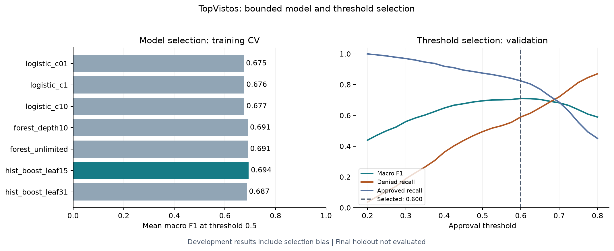

# TopVistos EUA — Classificação de resultados de vistos

[English](README.md) | **Português**

Estudo reproduzível de classificação desenvolvido a partir do projeto da competição Kaggle **ML Olympiad for Students — TopVistos EUA**, de 2023. A implementação atual separa treino, validação e teste final reservado, ajusta o pré-processamento dentro de cada fold de treino e compara um conjunto limitado de modelos com seleção explícita do limiar.

## Resultados até aqui

O gradient boosting selecionado alcança **0,710 de F1 macro** em **3.567 casos de validação**, com limiar de aprovação de **0,60**. A seleção do modelo usou validação cruzada em cinco folds no treino; a escolha do limiar usou a validação. **Esses resultados de desenvolvimento têm viés de seleção; o teste final ainda não foi avaliado.**

| Métrica de validação | Baseline logístico, 0,50 | Boosting escolhido, 0,60 |
|---|---:|---:|
| F1 macro | 0,681 | 0,710 |
| F1 — classe aprovada | 0,824 | 0,813 |
| ROC-AUC | 0,769 | 0,776 |
| Recall — classe negada | 0,448 | 0,590 |

No boosting selecionado, elevar o limiar de 0,50 para 0,60 identificou 113 negativas adicionais e classificou 121 casos aprovados adicionais como negados. O [relatório de seleção](docs/SELECTION.pt-BR.md) explica essa troca, as sete configurações candidatas e a decisão congelada.



O [relatório original dos baselines](docs/BASELINE.pt-BR.md) continua disponível, incluindo o baseline de frequência que prevê aprovação para todos os casos. Os [resultados da seleção em JSON](docs/selection/metrics.json) e os [resultados dos baselines em JSON](docs/baseline/metrics.json) registram os experimentos separadamente.

## Reproduzir o experimento

Use uma versão **estável do Python 3.11**. A execução registrada usou Python 3.11.14 no Windows. As dependências estão fixadas em [requirements-lock.txt](requirements-lock.txt). Execute os comandos na raiz do repositório.

Windows PowerShell:

```powershell
py -3.11 -m venv .venv
.venv/Scripts/python.exe -m pip install -r requirements-lock.txt
.venv/Scripts/python.exe -m unittest discover -s tests -v
.venv/Scripts/python.exe -m topvistos.baseline
.venv/Scripts/python.exe -m topvistos.selection
```

Linux/macOS:

```bash
python3.11 -m venv .venv
.venv/bin/python -m pip install -r requirements-lock.txt
.venv/bin/python -m unittest discover -s tests -v
.venv/bin/python -m topvistos.baseline
.venv/bin/python -m topvistos.selection
```

Obtenha os [dados necessários](data/README.pt-BR.md) e coloque-os em `data/raw/` antes de executar o experimento. O baseline exige o hash registrado do `train.csv`. Os testes usam dados sintéticos e dispensam os arquivos da competição. A integração contínua instala as dependências fixadas e executa os testes no Linux.

As saídas ficam em `reports/generated/baseline/` e `reports/generated/selection/`: métricas, gráficos, modelos locais e decisão selecionada. Essas pastas são ignoradas pelo Git; somente resultados agregados, metadados da decisão e gráficos são selecionados para a documentação. Carregue modelos serializados apenas de uma fonte confiável.

## Decisões de implementação

- Divisão determinística e estratificada 60/20/20; a validação cruzada em cinco folds usa somente a partição de treino.
- Imputação, escala e codificação de categorias ajustadas dentro do pipeline; inferência aceita valores ausentes e categorias desconhecidas.
- IDs e alvo ficam fora das variáveis. Quantidades negativas de empregados viram valores ausentes com um indicador.
- Precisão e recall usam a ordem correta dos argumentos; ROC-AUC usa probabilidades.
- Testes cobrem integridade dos dados, separação das partições, isolamento do pré-processamento, métricas, serialização e execução sem variáveis ou rótulos do teste final.

## Escopo e próximos passos

O estudo modela o rótulo histórico `status_do_caso`: `Aprovado=1`, `Negado=0`. Não foi validado para determinar elegibilidade a vistos ou automatizar decisões de imigração. F1 macro é um critério interno de desenvolvimento; a variante oficial de F1 e o resultado no ranking da competição permanecem sem verificação.

A seleção de modelo e limiar está concluída. Próximo passo: avaliar o pipeline e o limiar congelados no teste reservado, examinar calibração e os erros por segmentos relevantes. A base original já foi explorada no notebook histórico; a partição reservada não representa nova evidência externa. Os resultados atuais não são diretamente comparáveis aos do notebook, que usa outra divisão.

## Trabalho histórico e fonte dos dados

- [Notebook original (português)](ml-olympiad_top-vistos-eua_solucao.ipynb), preservado intacto.
- [Auditoria de reprodução](docs/REPRODUCIBILITY.pt-BR.md).
- [Manifesto agregado dos dados](docs/data-manifest.json).
- [Descrição original da competição (português)](docs/competition-description.pt-BR.md).

André Lopes. *ML Olympiad for Students — TopVistos EUA* (2023), [Kaggle](https://www.kaggle.com/competitions/ml-olympiad-for-students-topvistos-eua). O autor forneceu arquivos locais com as contagens históricas de linhas; a origem do download não foi verificada independentemente. Os dados brutos não são redistribuídos.