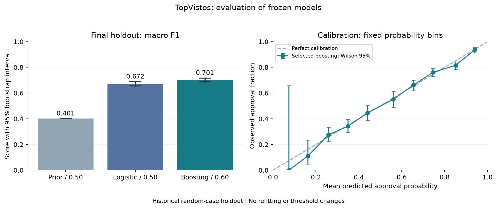

# TopVistos EUA — Classificação de resultados de vistos

[English](README.md) | **Português**

Estudo reproduzível de classificação desenvolvido a partir do projeto da competição Kaggle **ML Olympiad for Students — TopVistos EUA**, de 2023. A implementação atual separa treino, validação e teste final, ajusta o pré-processamento dentro de cada fold de treino e compara um conjunto limitado de modelos com seleção explícita do limiar.

## Avaliação final

O gradient boosting selecionado alcançou **F1 macro de 0,701** nos **3.568 casos do teste final**, com intervalo bootstrap de 95% de **0,686–0,717**. O limiar de aprovação **0,60** foi definido na validação antes da avaliação final.

| Métrica no teste final | Frequência / 0,50 | Logística / 0,50 | Boosting selecionado / 0,60 |
|---|---:|---:|---:|
| F1 macro | 0,401 | 0,672 | 0,701 |
| F1 — classe aprovada | 0,802 | 0,817 | 0,808 |
| ROC-AUC | 0,500 | 0,762 | 0,773 |
| Recall — classe negada | 0,000 | 0,443 | 0,576 |
| Recall — classe aprovada | 1,000 | 0,881 | 0,820 |

O selecionado identifica mais negativas que a regressão logística, mas também erra mais casos aprovados. O desempenho varia bastante por escolaridade: a melhoria agregada não demonstra adequação a decisões individuais.



O [relatório de avaliação final](docs/EVALUATION.pt-BR.md) inclui incerteza, calibração, análise de erros e limitações. O [apêndice de segmentos](docs/evaluation/SEGMENTS.pt-BR.md) apresenta cada grupo predefinido e seu suporte. Os [resultados finais em JSON](docs/evaluation/metrics.json) registram métricas e hashes dos artefatos.

Os relatórios de [baseline](docs/BASELINE.pt-BR.md) e [seleção de modelos](docs/SELECTION.pt-BR.md) preservam as etapas anteriores de desenvolvimento. Seus resultados de validação são distintos dos resultados de teste final. O teste final já foi avaliado e não deve orientar novos ajustes.

## Experimentar o exemplo público

Use uma versão **estável do Python 3.11**. A execução registrada usou Python 3.11.14 no Windows. As dependências estão fixadas em [requirements-lock.txt](requirements-lock.txt). Execute os comandos na raiz do repositório.

Windows PowerShell:

```powershell
py -3.11 -m venv .venv
.venv/Scripts/python.exe -m pip install -r requirements-lock.txt
.venv/Scripts/python.exe -m unittest discover -s tests -v
.venv/Scripts/python.exe -m topvistos.predict --input examples/synthetic_cases.csv --check-input
```

Linux/macOS:

```bash
python3.11 -m venv .venv
.venv/bin/python -m pip install -r requirements-lock.txt
.venv/bin/python -m unittest discover -s tests -v
.venv/bin/python -m topvistos.predict --input examples/synthetic_cases.csv --check-input
```

Esses comandos funcionam sem os dados da competição ou binários dos modelos. O [exemplo sintético](examples/README.pt-BR.md) inclui saída ilustrativa; o [guia de inferência](docs/INFERENCE.pt-BR.md) explica a previsão com um artefato confiável e o limiar registrado.

## Reproduzir o desenvolvimento

Para reproduzir o desenvolvimento histórico, obtenha os [dados necessários](data/README.pt-BR.md), coloque-os em `data/raw/` e use o Python do ambiente:

```text
python -m topvistos.baseline
python -m topvistos.selection
```

O baseline exige o hash registrado do `train.csv`. Os testes usam dados sintéticos e dispensam os arquivos da competição. A integração contínua instala as dependências fixadas e executa os testes no Linux.

As saídas de desenvolvimento ficam em `reports/generated/baseline/` e `reports/generated/selection/`: métricas, gráficos, modelos locais e decisão selecionada. Essas pastas são ignoradas pelo Git; somente resultados agregados, metadados da decisão e gráficos são selecionados para a documentação. Carregue modelos serializados apenas de uma fonte confiável.

A avaliação final carrega os artefatos congelados e verifica seus hashes exatos; nunca ajusta um modelo. Consulte as [instruções de avaliação](docs/EVALUATION.pt-BR.md#artefatos-e-reprodução) para requisitos dos artefatos, comandos e limites entre ambientes.

## Decisões de implementação

- Divisão determinística e estratificada 60/20/20; a validação cruzada em cinco folds usa somente a partição de treino.
- Imputação, escala e codificação de categorias ajustadas dentro do pipeline; inferência aceita valores ausentes e categorias desconhecidas.
- IDs e alvo ficam fora das variáveis. Quantidades negativas de empregados viram valores ausentes com um indicador.
- Precisão e recall usam a ordem correta dos argumentos; ROC-AUC usa probabilidades.
- Testes cobrem integridade dos dados, separação das partições, isolamento do pré-processamento, métricas, serialização execução de desenvolvimento sem variáveis ou rótulos do teste final e avaliação final sem novo ajuste.

## Escopo e próximos passos

O estudo modela o rótulo histórico `status_do_caso`: `Aprovado=1`, `Negado=0`. Não foi validado para determinar elegibilidade a vistos ou automatizar decisões de imigração. F1 macro é um critério interno de desenvolvimento; a variante oficial de F1 e o resultado no ranking da competição permanecem sem verificação.

A seleção de modelo e limiar e a avaliação final estão concluídas. A inferência está disponível por uma CLI com validação e exemplos sintéticos. O exemplo público e o fluxo de previsão foram conferidos em checkout separado e ambiente novo. Novas alterações no modelo exigem outro desenho de avaliação. A base original já foi explorada no notebook histórico; a partição reservada não representa nova evidência externa. Os resultados atuais não são diretamente comparáveis aos do notebook, que usa outra divisão.

## Trabalho histórico e fonte dos dados

- [Notebook original (português)](ml-olympiad_top-vistos-eua_solucao.ipynb), preservado intacto.
- [Auditoria de reprodução](docs/REPRODUCIBILITY.pt-BR.md).
- [Manifesto agregado dos dados](docs/data-manifest.json).
- [Descrição original da competição (português)](docs/competition-description.pt-BR.md).

André Lopes. *ML Olympiad for Students — TopVistos EUA* (2023), [Kaggle](https://www.kaggle.com/competitions/ml-olympiad-for-students-topvistos-eua). O autor forneceu arquivos locais com as contagens históricas de linhas; a origem do download não foi verificada independentemente. Os dados brutos não são redistribuídos.